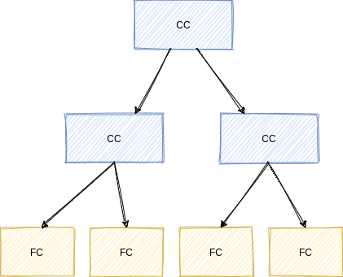
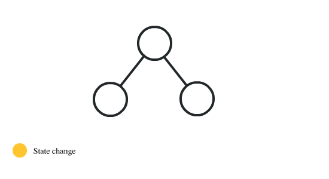
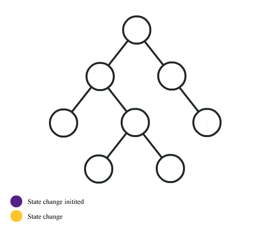

## Setting Develoment Environment

---

```bash
npx create-react-app fullstack-test-frontend-react
cd my-app
npm start
```

App will run at [http://localhost:3000](http://localhost:3000)

## Development

---

I divided my UI into small,independent, reusable components.In react, I have two choices to create a component-

- Class Based Component
- Funtion Based Component

**Now, which should I use in which situation?**

Funtion Components are literally JavaScript functions (pure).It can accepts a single props (properties). We can pass data to one component to another component through props. Functional components are stateless component.

```javascript
function Welcome(props) {
  return <h1>Hello, {props.name}</h1>;
}
```

Unlike functional component,Class Components are stateful compoent. Class component can have some additional features. Like we can add **local state** to class component.State is similar to props, but it is private and fully controlled by the component.
Class component has also **lifecyle methods** like _componentDidMount_, _componentWillUnmount_ etc.

```javascript
class Clock extends React.Component {
  constructor(props) {
    super(props);
    this.state = { date: new Date() };
  }

  componentDidMount() {}

  componentWillUnmount() {}

  render() {
    return (
      <div>
        <h1>Hello, world!</h1>
        <h2>It is {this.state.date.toLocaleTimeString()}.</h2>
      </div>
    );
  }
}
```

The _componentDidMount()_ method runs after the component output has been rendered to the DOM. _componentWillUnmount()_ method runns when component is removed from the DOM.

So, funtional components are tiny and clean but class component has state and lifecycle methods. As I divided my UI as small units with parent-child relationship. It creates a component tree structure,



I decided to use class components for parent components which has it's own state and child components as functional components. Parent Componet will send states to it's child components through props.This is commonly called a “top-down” or “unidirectional” data flow. Any state is always owned by some specific component, and any data or UI derived from that state can only affect components “below” them in the tree.


But there is a problem. Suppose we need to pass state to a certain child and for this we have to go through several componets to reach that component. This is called **prop drilling**



Here, Redux comes in play. **Redux** may help us. **Redux** can eliminate this problem. Through **Redux** we can manage our state and we don't need to prop drilling. We can have a center store and components will notify whenever their corresponding state changes.

But, **Redux is a third party library.** Using library like **Redux** just to manage a small application is a over kill. So what should we do now?

React version 16.3 introduces new **context api** and \*_life cycle hooks._ For many years, React has offered an experimental API for context. Although it was a powerful tool, its use was discouraged because of inherent problems in the API, and because we always intended to replace the experimental API with a better one. Version 16.3 introduces a new context API that is more efficient and supports both static type checking and deep updates.

So don't need **Redux** to manage our state. We can use \*_Context Api_ to do that.

And there is another thing called "life cycle hooks" in react verson 16.3. **Life Cycle Hooks** are nothing but replacements of life cycle methods. In prior version to use life cycle method, we need to use class components as they have life cycle methods. But, now we have \*\*Life Cycle Hooks". Through Life Cycle Hooks we can do the same thing in our functional componets!

So now, using Context API and Life Cycle hooks, our functional component can do the same thing as class components do.And guess what? We do not need to write those ugly class components anymore!!! We will only write functional components.


### Decisions:

- All componets will be functional components.
- Will use Context Api for state management.
- Will use life cycle hooks.

Enough talks. Now let's code.

## Let's Code

---

### Installation and Imports

We have a navigation bar. For navigation we use _React Router._.

> Install React Router

```bash
npm install --save react-router
```

> Import React Router on project

```javascript
import { Router, Route, Switch } from "react-router";
```

For styling I used css framework _Bulma_

> Install Bulma

```bash
npm install bulma
```

This application will call some api to fetch data. For calling API I used _axios_

> Install axios

```bash
npm install react-axios
```

> import axios on project

```javascript
import axios from "axios";
```

I also used TypeScript. It helps to write js code efficiently.Actually TypseScript is the missing part of JavaScript.

> Install TypeScript

```bash
npm install --save typescript @types/node @types/react @types/react-dom @types/jest
```

A json config file named \*tsconfig.json" will be created.
